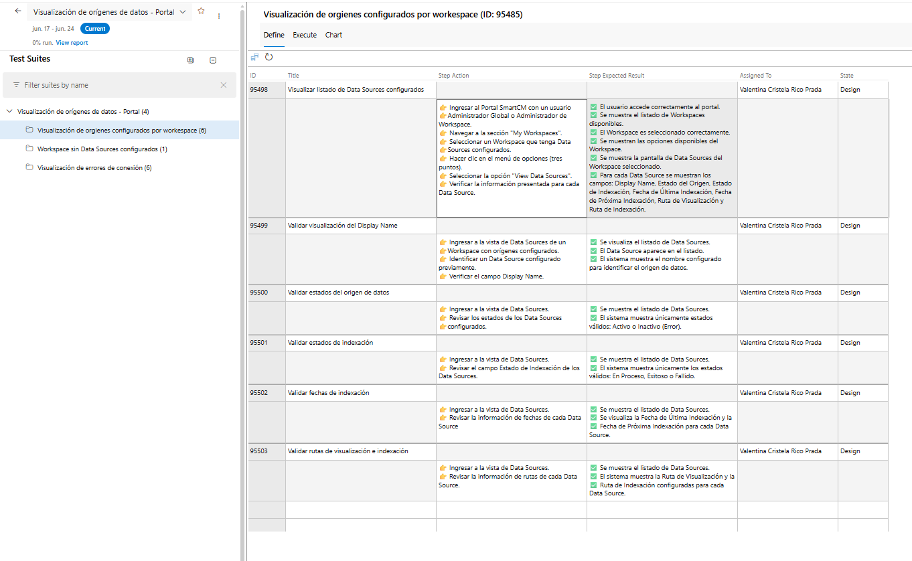

# Generate and register test cases in Grid View

## Visual reference

The final result in Azure DevOps should look like this:

The relevant columns are:

- **Title**: short and descriptive test case name
- **Step Action**: execution steps with 👉
- **Step Expected Result**: expected results with ✅
- **Assigned To**: assigned user (inherit from the work item if applicable)
- **State**: always starts in "Design"

## Test Case Assignment Rules

- Identify all acceptance criteria from the User Story.
- Each acceptance criterion has its own Suite.
- Create test cases only inside the Suite associated with the acceptance criterion from which they were generated.
- Never create test cases from different acceptance criteria in the same Suite.
- Maintain the relationship between Acceptance Criterion → Suite → Test Cases.

## Test Case Title Rules

Each title must describe the exact scenario being executed.

Format:

[Action] + [Condition/Context] + [Expected Behavior]

Examples:

- User uploads a valid PDF document and indexing starts successfully
- User uploads an unsupported file and receives a validation error
- User configures hierarchical segmentation levels and indexing completes successfully

Additional rules:

- Do not start titles with:
  - Validate
  - Verify
  - Check
  - Test

- Use business language whenever possible.
- A tester must understand what is being tested by reading only the title.
- Titles must be unique within their Suite.

## Step Format Rules

ALL Step Action entries must begin with:

👉

ALL Step Expected Result entries must begin with:

✅

This rule is mandatory.

## Generation Rules

Create complete and executable functional test cases that cover all scenarios necessary to validate each acceptance criterion.
For each acceptance criterion:
1. Analyze the required coverage.
2. Identify all required test scenarios.
3. Generate test cases according to coverage needs.
- Do not omit any acceptance criterion under any circumstances
- Steps must be atomic, sequential, and executable by a human tester without ambiguity
- Expected results must be concrete and verifiable.
- Each Step Action must have a corresponding Step Expected Result.
- Initial State of every test case must be Design.

## Format of Each Test Case

Title:
[Descriptive scenario title]

Step Action:
👉 [Specific action]
👉 [Specific action]
👉 [Specific action]

Step Expected Result:
✅ [Expected result]
✅ [Expected result]
✅ [Expected result]

## Reference Example

Title:
User views configured Data Sources successfully

Step Action:

👉 Log into the system with an Administrator user
👉 Navigate to the "My Workspaces" section
👉 Select a Workspace that has configured Data Sources
👉 Click the options menu (three dots)
👉 Select the "View Data Sources" option
👉 Verify the information displayed for each Data Source

Step Expected Result:

✅ The user successfully accesses the system
✅ The list of available Workspaces is displayed
✅ The Workspace is selected successfully
✅ The Workspace options are displayed
✅ The Data Sources screen is displayed
✅ For each Data Source, the following information is displayed: Display Name, Source Status, Indexing Status, Last Indexing Date, Next Indexing Date, Display Path, and Indexing Path

## Test Case Creation Workflow

For each acceptance criterion:

1. Identify the corresponding Suite.
2. Generate all required test scenarios.
3. Create the test cases inside that Suite (via the `ado-remote-mcp` tools).
4. Save the Test Case IDs.
5. Continue with the next acceptance criterion.

Repeat until all acceptance criteria have been processed.

## Error Handling

- If a test case creation fails, report the exact error.
- Retry when possible.
- If the error persists, ask the user how to proceed.

## What to Do When Finished

Present the user with the complete list grouped by Suite:

✅ Test cases created successfully:

### Suite: [SUITE NAME]

- [ID] — [Test Case Title]
- [ID] — [Test Case Title]

### Suite: [SUITE NAME]

- [ID] — [Test Case Title]
- [ID] — [Test Case Title]

### Suite: [SUITE NAME]

- [ID] — [Test Case Title]

You can review, modify, delete, or add test cases manually from Azure DevOps at any time.